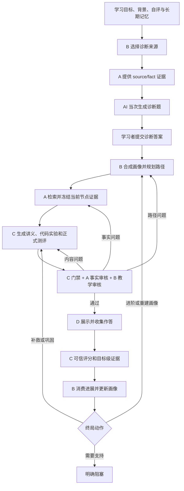

# Learning Orchestrator 正式运行设计

本文描述主 Agent 持续学习会话的当前运行合同。HTTP 字段和命令样例见 [`orchestrator_session_api.md`](./orchestrator_session_api.md)，Role C 内容、审核和评分细节见 [`role_c_design.md`](./role_c_design.md)。

## 1. 运行边界

主 Agent 负责会话编排、状态迁移、身份校验、持久化和 Agent 间交接，不直接编写课程内容、诊断题或测评题，也不在前端推断掌握状态。

正式入口为：

- 服务：`scripts/learning-orchestrator-api.ts`
- 会话聚合：`src/orchestration/interactive-session.ts`
- HTTP Schema：`src/orchestration/orchestrator-api-schema.ts`
- Role C 服务边界：`src/role-d-integration/role-c-service.ts`
- D 客户端：`src/role-d-ui-v2/src/orchestrator-client.ts`

会话请求中的 `mode: "deterministic"` 表示流程和状态迁移由确定性程序控制。诊断题、讲义、代码实验和正式测评仍由模型当次生成；模型未配置时正式会话阻塞，不切换到固定模板。

## 2. 正式学习链



## 3. 会话状态

公开状态：

| `status` | 含义 |
|---|---|
| `running` | 后端正在调用 Agent、审核或生成下一轮 |
| `waiting_for_user` | 等待诊断答案或正式测评答案 |
| `completed` | 非空正式学习路径的全部节点均已通过测评 |
| `blocked` | 缺少证据、目标不支持或无法形成新的支持路径 |
| `failed` | 运行依赖或不可恢复执行错误 |

公开阶段为 `objective_diagnosis`、`assessment`、`completed`、`blocked`、`failed`。只有服务端状态机可以迁移阶段；D 根据公开状态展示，不自行推进路径或改写终局。

课程终态由 `terminal_outcome` 说明。`PATH_MASTERED` 只在非空路径全部节点由正式测评推进后产生；空路径不能表示完成。知识库不支持目标、证据不足、路径规划失败和连续学习后仍需额外支持分别返回 `UNSUPPORTED_GOAL`、`INSUFFICIENT_EVIDENCE`、`PATH_PLANNING_FAILED` 和 `LEARNING_SUPPORT_REQUIRED`，并给出对应建议动作。临时模型、Docker 或生成故障不冒充课程终态。

## 4. AI 诊断命题

初始诊断按以下职责拆分：

1. B 根据学习目标、先修关系和长期薄弱点选择诊断来源。
2. A 为每个来源提供真实 `source_id/fact_id` 和事实文本。
3. `ModelDiagnosticQuestionAuthor`（`diagnostic-author-1.0.1`）为每个来源当次生成一道 3–4 选项单选题。
4. 程序校验来源、事实、题目数量、选项唯一性、唯一正确选项和历史防重。
5. 公开题面写入会话，正确选项写入 `private.diagnosis_answer_key`。

诊断命题不读取知识库 `quizItems` 作为学习者题面。生成失败最多执行有界修订；仍不合格时返回 `DIAGNOSTIC_GENERATION_FAILED`，不使用预制题替代。

## 5. 画像、路径与证据

B 使用背景、自评、客观诊断和长期记忆合成画像。客观表现优先于自评，冲突保存在 provenance 中。正式路径节点给出目标来源、先修来源和可观察行为。

A 的首轮检索结果由画像和学习目标构造。C 生成前按当前路径节点绑定 `source_id/fact_id`，并冻结为 `RagEvidencePack` 与 `GenerationSpec`。路径推进时必须使用当前节点证据；证据缺失、冲突或无法支持目标时保持阻塞。

## 6. Role C 三类资源

每轮 C 使用同一份画像快照、路径节点、证据包和 `GenerationSpec` 生成：

- 概念讲义：解释、示例、误区、即时检查和分层提示；
- 代码实验：公开任务与 starter、公开检查、提示，以及服务端参考实现和隐藏测试；
- 正式测评：选择、判断、追踪和代码题，以及服务端答案与评分合同。

三类资源必须覆盖同一组目标，并通过 Schema、事实引用、目标覆盖、public/secure 隔离、Docker 执行和跨产物一致性检查。随后由 A 审核事实和引用、B 审核路径目标、先修、难度与教学适配。

审核修复按问题归属执行：内容问题在当前 Spec 内定向修订，事实问题刷新 A 证据，路径问题调用 B 重规划。所有修订均有界；不通过的产物不能发布给 D。

## 7. AI 正式命题与防重

正式测评由 `tiered-evaluator` 根据当前 Spec、A 证据和讲义摘要当次生成，不从题库取题，也不存在固定题降级。

防重输入独立于 `next_round_context`，因此首轮正式测评也能看到刚发布的诊断题。会话和学习者记忆保留全部已发布公开题面用于确定性防重，模型只接收最近 200 道作为主动换题参考。正式试卷在发布前即登记，学习者未提交或中途退出也不会使题目重新变成可用新题。题面历史：

- 只包含题干、选项、题型和公开 starter；
- 只传给诊断命题器和正式测评的公开出题阶段；
- 不传给讲义、代码实验、私有答案和隐藏测试阶段；
- 不作为事实或指令使用。

相同知识和相近难度的新变式允许发布。题干相同、只更换干扰项、复制或仅格式改写会触发重新命题；达到修订上限仍重复时阻塞该轮。

## 8. 代码运行与评分

代码实验和正式代码题均通过 C 的 Docker Runner 执行。浏览器只提交学习者代码和当前公开资源身份；参考实现、隐藏测试、期望值和计分规则由后端从安全存储读取。

正式提交必须覆盖当前试卷全部必答题。评分冻结后形成题目级学习证据，包含真实题型、得分、提示级别、重复情况和置信度，并通过正式端口原子交给 B。

目标级动作规则：

| 条件 | 动作 |
|---|---|
| 任一目标正确率 `< 0.4` | `remediate` |
| 无低分目标，但任一目标正确率 `< 0.8` | `reinforce` |
| 全部被测目标 `≥ 0.8` 且为新卷首次、无提示、答案未曝光的独立作答 | `advance` |
| 同卷重试、使用提示或答案已曝光后达标 | `reinforce`，新卷独立确认 |
| 画像与客观证据出现明确冲突 | `reprofile` |

总分用于展示，不覆盖目标级判断。下一轮只读取 C 冻结的 `final_decision` 和 `target_objective_ids`。

同一节点连续补救 3 轮或巩固 2 轮后，主 Agent 请求 B 重新规划支持路径。B 无法产生新支持路径时返回 `LEARNING_SUPPORT_REQUIRED`，当前节点保持未掌握。

## 9. 持久化与并发

会话文件使用 revision CAS、文件锁、租约和原子替换，敏感文件权限为 0600。相同 `command_id` 和相同内容幂等重放；相同 ID 携带不同内容返回冲突。同一会话的命令串行处理。

会话私有状态保存：

- 诊断答案键和学习者诊断作答；
- 当前画像、路径、RAG、C run/session/spec 身份；
- 已发布公开题面历史；
- 冻结评分、反馈和下一轮上下文；
- B 返回的新画像和路径状态。

长期 learner memory 保存掌握、薄弱点、已完成会话和最近公开题面。模型/API/Docker 调用期间会话保持 `running`；完成后原子发布新的等待、完成或阻塞状态。

## 10. API 与 D 消费

正式会话 API：

| 方法与路径 | 用途 |
|---|---|
| `POST /orchestrator/sessions` | 创建会话并生成 AI 诊断题 |
| `GET /orchestrator/sessions/:id` | 读取公开会话视图 |
| `GET /orchestrator/sessions/:id/events` | 读取公开事件 |
| `POST /orchestrator/sessions/:id/commands` | 提交诊断、运行代码、提交测评或重试 |
| `POST /orchestrator/sessions/:id/repair` | 显式迁移不兼容的持久会话 |
| `GET/PUT /orchestrator/provider-config` | 本机回环地址配置模型 Provider |

D 只消费公开视图：讲义、实验、题面、代码运行摘要、逐题反馈、路径状态、阻塞原因和正式课程终态。D 不接收诊断答案、正式答案、参考实现、隐藏测试、内部掌握参数或安全存储引用。

## 11. 可观测性与验证

公开事件记录会话创建、Worker 调用、等待用户、生成、审核、评分、下一轮和终局。日志记录输入/产物身份、状态和安全诊断，不记录模型内部思考，不输出密钥或私有答案。

统一检查：

```bash
bun run check
```

真实运行还需要模型 Provider 和 Docker。正式验收应从 HTTP 会话入口依次完成 AI 诊断、画像与路径、A 证据、C 三类资源、代码执行、正式评分、B 进展消费和至少一次 AI 新卷续轮。
