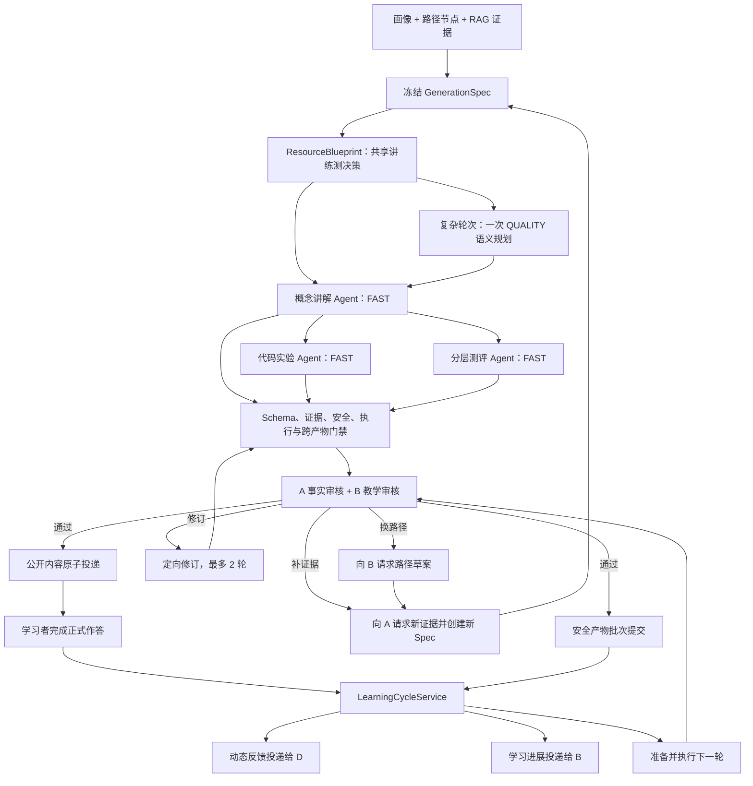

# Role C 内容生成与学习闭环设计

> 本文描述 Role C 当前正式生成、审核、评分与多轮学习合同。

| 项目 | 内容 |
|---|---|
| 设计版本 | 7.2 |
| Schema 版本 | 1.0 |
| Prompt manifest | `c-prompts-1.49.0` |
| 实现目录 | `src/role-c-content/` |
| Schema 目录 | `schemas/role-c-content/` |
| 自动检查 | `bun run check` |
| Docker 验收 | `bun run test:role-c:docker` |

## 1. 职责与合同

Role C 将版本化画像、学习路径和 RAG 证据转换为相互对齐的概念讲义、代码实验和分层测评，并完成内容审核、可信评分、动态反馈、学习证据、掌握度更新和下一轮生成。

| 方向 | 正式合同 |
|---|---|
| A → C | `RagEvidencePack` |
| B → C | `LearnerProfileSnapshot`、`LearningPathNode`、`RoleBPathPlanningResult` |
| D → C | `SubmissionEnvelope` |
| C → A | `EvidenceGapRequest`、`FactAuditPacket` |
| C → B | `RoleBPathPlanningRequest`、`RoleCLearningProgressDelivery` |
| C → D | `RoleCReviewedReleaseDelivery`、`RoleCReviewRecoveryStatusDelivery`、`RoleCLearningSessionDelivery`、`RoleCDynamicFeedbackDelivery` |

学习会话由认证后端创建。题目答案、参考实现、隐藏测试、评分比较值、Beta 参数、幂等账本和 `secure://role-c/...` 引用均保存在后端。

### 1.1 统一语义

| 名称 | 项目内定义 | 权威来源 |
|---|---|---|
| 目标 | 当前路径节点中可观察、可练习、可测量的学习结果；以 `objective_id` 标识并绑定一个 `source_id` 和必要 `required_fact_ids` | B 的 `LearningPathNode.objectives`，进入 C 后由 `GenerationSpec.targets` 冻结 |
| 事实 | A 知识库中可独立引用的最小知识陈述；身份为 `source_id + fact_id` | A 的 `RagEvidencePack.results[].facts[]` |
| 引用 | 公开知识性内容对当前冻结事实的指向，包含 `source_id`、`fact_id` 和关系类型 | C 生成，A 事实审核确认支持关系 |
| 难度 | 当前节点的领域复杂度、认知要求、推理步数、代码复杂度、先修负荷和脚手架强度 | B 决定路径难度；C 冻结为 `GenerationSpec.difficulty`，只调整呈现层 |
| 先修 | 理解当前目标前必须具备的知识来源或桥接内容 | B 的 `prerequisite_source_ids`，A 提供对应事实，C 负责呈现桥接内容 |
| 掌握 | 基于正式新卷首次作答、提示使用、重复曝光、评分置信度和历史证据形成的目标级状态 | C 冻结本轮成绩和学习证据；B 维护跨轮画像，主 Agent 维护会话进度 |
| 修复 | 对已分类问题执行的最小纠正动作：当前资源重写、补证据或换路径 | C 处理 `artifact`，A 处理 `new_evidence`，B 处理 `new_spec`，主 Agent 负责状态迁移 |
| 完成 | 非空路径中的节点均完成，最后一个节点经独立正式测评得到 `advance`，且没有待处理阻塞或复核 | 主 Agent 的持久会话状态机 |

## 2. 总体流程



内容流水线状态为 `PLANNED → GENERATING → VALIDATING → READY/BLOCKED/FAILED`。学习提交状态为 `RECEIVED → SCORED → DECIDED → MASTERY_APPLIED → COMPLETED`，并包含 `BLOCKED` 和 `NEEDS_REVIEW` 终态。

## 3. 冻结输入

`buildGenerationSpec` 校验并冻结：

- 画像、路径和证据的完整内容哈希及版本；
- 目标、必要事实、先修关系和可观察行为；
- 难度向量、测评蓝图、资源限制和安全策略；
- Prompt、模型配置、Runner 镜像和随机 seed。

Locked Core 包含事实、目标、先修、代码语义、答案和评分规则。Adaptive Shell 包含解释顺序、案例语境、阅读密度、提示层级和脚手架。个性化参数只调整 Adaptive Shell。

初始目标发现使用 `semantic_discovery`；路径节点冻结后使用 `identity_hydration`；材料不足时 C 生成带原目标身份的 `EvidenceGapRequest`，A 以 `evidence_repair` 创建新证据。每次结果均包含检索身份、请求哈希、父级血缘和目标级覆盖。`weak`、`no_match` 或事实冲突保持结构化阻塞状态。

知识条目在加载时统一投影为 V2 教学结构：事实包含适用范围、例外、先修、置信度和权威等级；条目同时提供与事实绑定的误区、正反例、可观察目标和练习模板。旧知识文件仍可读取，缺少的教学元数据只从同一条目内已审核事实、题目和示例派生，不补充外部知识。

目标发现采用混合检索：中文 n-gram BM25、可选向量相似度、目标/先修/误区/资源需求元数据匹配与 MMR 去冗余共同排序。路径冻结后的取证仍按 source/fact 身份精确水合。检索结果显式报告目标、必要事实、误区、示例与反例的充分性；必要材料不足时在生成前返回缺口，不进入内容作者。

## 4. 三个内容 Agent

| Agent | 主要产物 | 核心门禁 |
|---|---|---|
| 概念讲解 `concept-tutor` | 先修桥梁、概念解释、示例、误区、即时检查、三级提示和目标映射 | 目标覆盖、事实引用、可见正文审核 |
| 代码实验 `code-lab` | public 任务、starter、公开测试、提示；secure 参考实现、隐藏测试和评分组 | public/secure 对齐、参考实现、Docker 执行、泄漏检查；mutation 仅记录可选质量指标 |
| 分层测评 `tiered-evaluator` | Tier 1/2/3 题面、稳定题目身份、secure AnswerSpec、rubric 和代码测试 | 蓝图覆盖、答案一致性、代码执行、选项与评分语义 |

程序先从同一份 `GenerationSpec` 和证据包生成递归冻结的 `ResourceBlueprint`。蓝图逐目标声明必要事实、讲义结构、代码实验练习行为、测评认知操作、题型与分值。三个 Agent 只读取属于自己的蓝图投影，因此讲、练、测在生成前已对齐，不依赖后置门禁推测意图。模型生成互动题、提示、练习任务和正式测评等开放内容；程序生成稳定 ID、引用、覆盖索引、题型和分值。

蓝图同时冻结 `cross_artifact_contract` 和 `quality_requirement`。标准轮次直接进入 FAST 结构化生成；复杂轮次先用一次 `QUALITY / reasoning_effort=high` 生成紧凑 `RoundSemanticPlan`，只规划教学叙事、实验意图和考查角度。完整讲义、实验、测评、私有答案、审核和修复始终使用 FAST。语义规划失败时仍可由确定性蓝图完成有效生成，不改变目标、证据、代码 ABI 或评分合同。

### 4.1 分阶段生成

| Agent | 调用阶段 |
|---|---|
| concept-tutor | 按目标组生成片段（并发 2），再按目标顺序确定性聚合 |
| code-lab | 先冻结公开任务；再分别生成参考实现和测试输入；可信程序执行参考实现后派生隐藏预期并组装 secure |
| tiered-evaluator | 先冻结 item plan，再生成 public 和 secure |

每个阶段执行局部 Schema 与语义校验，聚合后执行完整检查。讲义完成后，代码实验与测评依据共享蓝图并行生成，最终再汇合执行跨产物一致性检查。检查点覆盖语义规划、讲义、任一独立分支和双分支就绪状态，并记录 Spec、Blueprint、模型、Prompt、策略决策和证据哈希；依赖变化时旧检查点失效。检查点使用原子文件、完整性哈希和仅所有者可读权限，其中的 secure 产物不进入会话公开数据。

结构化输出若以 `finish_reason=length` 截断，只重试当前阶段：保留语义规划和上游检查点，继续使用 FAST，并将该阶段 token 上限增加 50% 后重新执行本地 Schema 与业务校验。

公开测评与历史题面重复时，程序冻结合格题并给出重复题下标，模型只重新命制对应题目。局部补丁合并后重新执行题目计划、证据、目标覆盖和防重校验；题目内容始终由模型生成。

题型由冻结的 `item_plan` 决定。B 提供题量、Tier 和必选题型；C 根据每个 objective 的 `observable_behavior`、Tier 和学习者语境为其余槽位选择能直接测量的题型与认知操作，不再强制所有目标使用同一五题配方。程序只规范与题型唯一对应的结构字段：非选择题的 `options` 为 `null`，非代码题的 `starter_code` 为 `null`；代码题遗漏或误填完整实现时，保留题面约定的函数签名并转换为待完成骨架。

### 4.2 下一轮语义

`next_round_context` 只影响内容重点和呈现：

- `focus_objective_ids` 优先讲解、练习和检查，全部冻结目标仍保持完整覆盖；
- `remediate` 增加步骤、示例和提示，降低无关认知负荷；
- `reinforce` 生成同难度的新情境或新变式；
- `advance` 使用新路径节点和新证据，历史反馈只影响重点与脚手架。

概念分段只接收本段包含的 focus 目标，防止跨目标误用补救指令。

### 4.3 统一教学设计与候选选择

`LearningDesignSpecV2` 在三类内容生成前一次构建，包含目标掌握区间、证据依据、误区概率、适配决策、讲义序列、测评构念和证据标准。三个 Agent 消费同一份设计，不分别猜测学习者需要。

公开内容采用候选竞赛：讲义目标组、代码实验和每一道测评题分别并行生成 3 个语义候选。程序先执行 Schema、引用、安全、执行合同与题目有效性检查；独立模型审查者再批量检查事实接地、语义正确性和教学价值。候选的核心维度不得被平均分掩盖，只有通过硬检查与核心最低分的候选才参与确定性排序。代码参考解、隐藏测试、答案和评分规范在公开候选确定后只生成一次。

测评按题冻结构念、认知要求、题型、引用事实、目标误区和表现形式。每题作者只能看到该题引用的事实；选择题干扰项必须能由当前题事实直接否定，提示词示例不得充当题目知识。题面仍由模型当次生成，程序不保存固定题库作为生产答案来源。

### 4.4 资源难度适配

`difficulty_plan` 为讲义、代码实验和正式测评分别声明目标挑战与目标支架。生成后的 `resource_fit` 从公开产物的真实结构估计观测值，再与对应目标比较；分数用于解释本轮资源结构，不替代发布审核。

- 讲义的认知与推理目标最低为 1，表示一次直接识别或解释活动；0 仅表示该维度不适用；
- 正式测评的目标难度按 `item_plan` 中每题的认知要求和分值加权汇总；Tier 3 只有在规划为 `scenario_transfer` 时才计入迁移距离；
- 正式测评的观测难度同样按题目分值加权，结构元数据决定识别、应用、分析、诊断或构造要求；题干中偶然出现“编写”“程序”等领域词不改变题型认知操作；
- 代码实验的 starter 支架按真实已提供骨架和学习者待完成区域估计。事实识别型实验必须提供赋值与输出胶水，只允许学习者替换一个明确文本占位；
- 代码实验按可观察行为投影最小事实切片：识别型使用 1 条、解释型最多 2 条、应用及以上最多 4 条；完整必要事实仍由讲义和整卷测评覆盖，不能把整章事实重复堆入一个实验任务；
- public/secure 泄漏修订按字段清理 starter、完整编程任务卡和实操指南中的实现片段；未泄漏的任务说明、公开测试、三级提示和反思问题保持原样。

### 4.5 定制化编程实训

代码实验先由确定性 `ProgrammingProblemBlueprint` 冻结任务形态、学习者作答区域、执行合同和测试分区，再由模型当次创作题面、公开样例、参考实现及测试输入。任务不从固定题库抽取，允许同知识点生成相近训练，但题面、数据和任务结构随当前目标、画像与学习进展变化。

- 支持程序填空、函数实现、标准输入输出程序和调试改错四种任务；作答既可提交完整代码，也可只提交服务端声明的 gap answers；
- gap contract 明确声明答案格式；内部占位标记只参与服务端物化，不向学习者展示。前端显示完整代码预览和逐空填写说明，服务端对字符串字面量等格式执行同源校验；旧产物可依据题目标签迁移到相同交互；
- 初学者与补救轮次增加显式骨架、公开样例和三级提示；迁移与竞赛目标增加边界、反硬编码和错误路径用例；
- 模型只生成测试输入候选。隐藏预期由可信 Docker 执行参考实现得到，数值输出按冻结容差比较，其余输出按规范化值精确比较；需要双重预言机时，两份独立实现的输出必须一致；
- 公开样例与隐藏输入在组装前统一规范化并去重；无输入的纯输出协议只保留一个协议级空输入，不把它误判为测试泄漏；
- 公开题面、编程任务卡、填空模板、实操指南、提示和样例全部参与答案泄漏检查。定向修订覆盖完整公开产物，不降低事实与安全审核要求；
- `debug_code_lab` 只运行公开样例或自定义输入，用于快速调试；`submit_code_lab` 执行正式隐藏评测并返回成熟判定（通过、编译错误、结果错误、运行错误、超时、超内存、输出超限或安全违规）；
- 前端只提交学习者代码或 gap answers。服务端完成填空物化、自定义输入规范化、安全存储读取和 Docker 评测，不向页面返回参考实现、隐藏用例或预期值。

三类资源分数按 30%/35%/35% 加权，并受最弱资源分数加 0.08 的瓶颈上限约束。目标与观测使用同一教学语义，不能通过直接抬分、放宽容差或把高阶题从测评中删除来提高指数。

## 5. 内容验证与 A/B 审核

C 内部门禁依次检查：

1. JSON Schema、状态语义和冻结输入身份；
2. Claim、引用和全部学习者可见正文的事实接地；
3. public/secure 分离和敏感值泄漏；
4. 参考实现、starter、公开测试和隐藏测试；可选错误变体只形成质量指标；
5. 测评题面、AnswerSpec、rubric 与代码测试；
6. 讲义、实验、测评之间的目标、难度和答案对齐。

确定性跨产物检查只处理目标映射、可执行性和答案一致性等结构问题。公开候选的独立模型 Critic 参与候选淘汰，但不改写内容；最终稿随后交给 A 检查事实和引用、B 检查目标、先修、难度和教学适配。B 对当前产物的难度判断读取冻结 `GenerationSpec.difficulty`，知识库目标标签只用于路径规划，不替代本轮实际教学负荷。外部审核最多修订两轮，并始终使用同一份冻结输入。

审核请求和结果绑定 `pipeline_input_hash`、`generation_spec_hash`、`GenerationSpec.evidence_content_hash`、三份公开产物哈希、审核策略版本和修订序号。B 的结构化结果包含失败维度、缺失先修、未知先修引用、恢复动作、修复范围、建议难度和可恢复状态。

当修复范围为 `artifact` 时，审核意见作为结构化 `revision_objections` 交给对应生成 Agent。该合同保留审核指令 ID、审核方、原始问题码和消息、原始裁决、目标 Agent/产物、objective、字段定位、证据引用、修复范围和建议动作。公共提示词明确这些字段是修订控制数据，不是事实证据；Agent 须逐条处理属于自己的产物级指令，不得在内容阶段伪造新证据或改写路径。后续 Schema 修复不得撤销已完成的外审修订。

恢复动作如下：

| 修复范围 | C 的处理 |
|---|---|
| `artifact` | 在当前 Spec 内定向修订，最多两轮 |
| `new_evidence` | 向 A 请求指定知识点的新证据，验证覆盖后创建新 Spec 并重新生成、审核 |
| `new_spec` | 调用 B 路径规划，校验路径草案，向 A 取证并绑定事实后创建新 Spec |

每轮跨 Spec 恢复均记录输入、输出和 A/B 请求标识，最多两次。未知先修引用、无效 B 响应和不可支持目标返回结构化阻塞结果。

### 5.1 质量问题分类与唯一处理路径

| 类别 | 检查内容 | 权威发现者 | 修复负责人 | 状态迁移 |
|---|---|---|---|---|
| 发布安全 | Schema、公开/私有隔离、答案与隐藏测试泄漏、参考解和评分材料、可信执行与答案一致性 | C 的确定性校验器和 Docker 执行器 | C | 可局部修复时回到对应 Agent；预算耗尽为 `BLOCKED`；基础设施异常为 `FAILED` |
| 事实支持 | evidence 身份与强度、引用存在、声明是否被引用事实支持 | C 做身份与存在性预检；A 对事实支持作最终审核 | 现有事实足够时由 C 改写；证据不足时由 A 补证据 | `artifact` 或 `new_evidence`，随后重新生成并审核 |
| 教学质量 | 目标覆盖、讲练测一致、难度、先修、路径适配和具体资源的教学表达 | B 对路径、难度和先修负责；C 对具体讲义、实验、测评及跨资源一致性负责 | 路径问题由 B；资源内容问题由 C | `artifact` 或 `new_spec`，不得把路径问题交给 C 改文案 |
| 运行诊断 | 模型调用、JSON 截断、Docker 超时、存储、并发和网络错误 | 实际失败的运行组件 | 对应运行组件或主 Agent | 有界重试；仍失败进入 `FAILED`，不得伪装成内容质量问题 |

同一问题只由上表对应的权威路径决定修复范围。分阶段作者校验只用于当次模型修复，`finalizeDraft` 负责单份产物合同，`runCPipeline` 负责跨产物一致性，A/B 审核负责外部语义结论，`assertReviewedReadyPipeline` 负责发布边界复核，学习会话只在读取 secure 产物后复核 public/secure 配对。这些边界复核复用同一校验函数，不另设阈值或第二套状态决策。

### 5.2 生成失败与恢复合同

模型只生成教学语义，ID、题目计划、引用、目标覆盖、public/secure 配对和发布状态由程序组装。可安全确定的题型空值、代码骨架和测试比较方式在进入完整门禁前规范化；隐藏测试 `expected` 与输出合同冲突时，由可信 Docker 执行参考程序后按实际输出修正，不要求模型猜测运行结果。

Agent 内部仅修复本阶段失败项。公开题目重复时冻结其余题目，只重新命制重复下标；代码实验和测评的公开、私有阶段分别修复。主 Agent 不再根据中文错误摘要自动重跑整套 C，也不叠加内外两层生成预算。

未能在本阶段恢复的结果使用 `RoleCGenerationFailure` 返回：`code`、`stage`、`issueCodes`、`repairScope`、`nextAction`、`canRetry` 和 `fingerprint`。会话将其转为私有 `generation_recovery`，保持原 `run_id/spec_id` 并用新恢复身份改变失败阶段的模型请求；已通过阶段从检查点恢复。私有校验值不会进入公开合同，只公开稳定问题码。同一轮连续两次内容生成失败后停止重试并要求调整目标。

诊断、首次 C 生成、续轮和产物重生均作为持久任务执行。每个任务原子落盘，包含 deadline、调用预算、检查点引用、lease 和 heartbeat；服务启动时恢复 queued、retry_wait 和 lease 已过期的 running 任务。成功进入 `waiting_for_user`；失败进入带结构化终局的 `blocked` / `failed`。D 优先通过 SSE 接收阶段事件，断线时按事件序号续接，轮询只作为兼容方式。

### 5.3 项目级模型运行时

所有 GLM 调用统一经过 `src/model-runtime/`：

- `FAST`：关闭思考，处理诊断、完整资源、私有内容、审核和修复；
- `QUALITY`：开启思考并使用 `reasoning_effort=high`，只处理复杂轮次紧凑规划；
- `OFFLINE_MAX`：开启思考并使用 `reasoning_effort=max`，仅供离线评测；
- 全局模型并发 3，QUALITY 并发 1，OFFLINE_MAX 并发 1，审核与交互请求优先；
- 每个工作流共享总时限、模型调用数和传输重试预算；调用上限由目标数、测评题量、公开候选数、内部修复和外部修订轮数确定性计算；认证、余额、权限和参数错误不重试，瞬时网络或服务拥堵只做一次带抖动重试；
- 连续瞬时故障触发短时熔断，调用遥测只保存策略、耗时、排队、token、finish reason 和安全错误码，不保存 reasoning 内容。

### 5.4 公开内容语义事实审核

发布审核以当前冻结的 evidence pack 为唯一事实边界。程序先检查每个公开块的引用是否存在；随后语义审核一次读取同一产物内的可见内容和各块所引事实，逐块区分：

- `supported`：知识陈述由所引事实支持；
- `non_factual`：标题、任务指令、提问或学习脚手架本身不提出新的知识事实；
- `unsupported`：内容提出了当前引用不能支持的事实；
- `uncertain`：现有证据不足以稳定判断支持关系。

C 的正式创作上下文只投影带 `source_id + fact_id` 的事实。RAG 中没有事实身份的示例、练习和题目种子仍可由 A 保留，但不进入 C 的可发表知识上下文；这避免模型使用了检索示例却无法给正文提供有效事实引用。新名称、新数值和虚构对象可作为已引事实的直接实例，不能借实例补充新的 API、语法、返回类型或运行机制。

审核结果必须与全部块 ID 一一对应，缺项、重复项或未知项均视为审核结果无效。`unsupported` 和 `uncertain` 会形成带产物、字段定位、目标和证据引用的结构化问题；不会因 JSON 合法或引用存在而放行。讲义、实验说明、公开测试、提示、反思问题，以及测评题干、选项和代码骨架均进入同一审核入口。正式测评在提交前不公开答案解析；答案和隐藏判分材料保留在 secure 合同中。

产物级问题在原 Spec 内最多修订两轮：第一轮针对问题块改写，第二轮重写对应语义单元、减少无必要知识陈述并降低呈现负荷，但不改变冻结目标、事实、标准和答案。证据不足转 A 补证据，先修、难度或路径问题转 B 重新规划。换 Spec 后重新生成并重新审核，日志以 `spec_id` 区分原规格修订和路径恢复；预算耗尽后返回结构化阻塞状态。

## 6. 发布与回执

审核通过后执行以下提交与发布：

1. `code_lab_secure` 与 `assessment_secure` 通过 `putBatch` 提交为一个安全存储批次；
2. 三份公开产物与 trace 组成 `RoleCReviewedReleaseDelivery`；
3. 完整正式测评组成 `RoleCLearningSessionDelivery`；
4. `BLOCKED`、`FAILED` 和 `UNSUPPORTED_TARGET` 组成 `RoleCReviewRecoveryStatusDelivery`。

学习完成后，动态反馈通过 `RoleCDynamicFeedbackDelivery` 投递给 D；学习证据和可选画像漂移建议通过 `RoleCLearningProgressDelivery` 投递给 B。

每个 envelope 包含稳定 `delivery_id`。审核发布身份绑定 Spec、审核结果、三份产物和 trace 语义，排除 trace 序号、时间和耗时等遥测字段；相同业务结果重新执行仍保持同一投递身份。接收方以该 ID 原子提交，并返回同 ID、同类型的 `accepted` 或 `duplicate` 回执。相同学习证据按 `event_id` 排序，因此输入顺序不影响投递身份。Reviewed release、恢复状态和学习会话使用独立投递身份，任一失败均可按原 ID 重试。

审核未通过的内容不能进入 reviewed release；其结构化状态通过恢复状态合同交给 D。

## 7. 代码执行与评分

Python 代码统一使用 `DockerPythonCodeRunner`：

- 使用本机解析后的不可变 image ID；
- 关闭网络，使用只读 root、非 root 用户和受限 tmpfs；
- 限制 CPU、内存、PIDs、执行时间和输出大小；
- 容器只接收学习者代码、测试输入和执行合同；
- `stdin_stdout` 按完整脚本执行并提供正常的 `__main__` 语义；`function` 按可调用函数合同执行，不触发主程序守卫；
- 期望答案、测试权重、比较规则和计分保留在后端。

评分支持 exact-set、numeric、code 和 concept-rubric。主观题逐 criterion 盲审；存在 `uncertain` 或加权置信度低于 `0.65` 时返回 `NEEDS_REVIEW`。

## 8. 学习闭环

`LearningCycleService` 的正式流程：

1. 注册通过中央审核门禁的 `READY` 运行，并复核 public/secure 配对；
2. 开启已冻结全部必答题的正式会话；
3. 独立校验认证 learner 与 `SubmissionEnvelope.learner_id_hash`；
4. 从 secure store 读取答案和代码测试，冻结 `GradeResult`；
5. 生成题目级 `LearningEvidenceEvent`，原子更新掌握度并交给 B；
6. 组装唯一公开结果 `DynamicFeedbackResult`；
7. 持久化成绩、题目历史、B 新画像和下一轮决策。

浏览器可调用的 `processSubmission` 只返回公开反馈或精简错误。学习证据、内部评分和 Beta 状态由后端入口 `processSubmissionInternal` 处理。

本轮动作规则：

| 条件 | 动作 |
|---|---|
| 任一目标正确率 `< 0.4` | `remediate`，聚焦这些低分目标 |
| 无低分目标，但任一目标正确率 `< 0.8` | `reinforce`，聚焦未稳定目标 |
| 本轮被测目标正确率全部 `≥ 0.8`，且是未用提示、未暴露答案的新卷首次作答 | `advance` |
| 同卷使用过提示、已公开答案或重复作答后达标 | `reinforce`，生成新等价题独立确认 |
| 明确画像漂移 | `reprofile` |

公开总分用于展示本轮整体表现，但不得掩盖某个未达标目标。主 Agent 直接使用 C 终局决策中的 `target_objective_ids`，不再重复应用阈值。

提示级别、重复曝光、grader confidence 和题目权重参与 evidence score 与长期掌握度更新。原卷在答案公开后只用于练习和反馈，正式进阶必须使用新卷。本轮动作、冻结成绩和全部学习证据使用同一 `final_decision`。

### 8.1 AI 动态命题与防重

- 初始诊断由 B 选择目标、先修和薄弱来源，A 提供对应事实，`diagnostic-author-1.0.1` 为每个来源当次生成一道单选题。题目必须绑定诊断计划中的真实 `source_id/fact_id`，正确选项只保存在服务端。模型返回的选项会按显示语义合并仅空白或标点不同的重复项，并同步正确项文本；合并后不足三项仍要求模型重新命制。
- 每份正式测评的题面、选项、追踪材料、代码任务和私有答案语义均由模型根据当前 `GenerationSpec` 和证据当次生成。诊断和正式测评均不从预制题库或固定题面中取题，也没有模板降级路径。确定性程序只组装身份、分值、引用、题型计划和评分结果。
- 会话和学习者记忆保留全部已发布的纯公开题面，用于全历史确定性防重；模型每次只接收最近 200 道作为主动换题参考，避免输入无限增长。题面在发布前即登记，未提交或中途退出的试卷也不会被当作新题再次使用。题面历史是独立流水线输入，因此首轮正式测评也会避开刚发布的诊断题；它只传给诊断命题器和 `tiered-evaluator` 的公开出题阶段，不传给讲义、实验或私有答案阶段。
- 模型允许考查同一知识和相近难度，但题干、选项组合、数据/场景和代码任务必须重新命制。
- 公开出题阶段会比对历史题面；题干相同、仅更换干扰项、复制或仅做格式变化的题目会在同一模型阶段收到修订原因并重新命题。达到修订上限仍不合格时阻塞该轮，不切换到固定题。
- 题目历史不含正确答案、误区映射、参考实现或隐藏测试。

## 9. 下一轮执行

后端通过 `LearningCycleService.prepareNextRoundFromCompletedSubmission` 从持久化的
`COMPLETED` 提交读取冻结反馈、GenerationSpec 和证据，再调用纯规划函数
`prepareNextRound` 产生确定性请求：

| 动作 | 输入与调整 |
|---|---|
| `remediate` | 复用当前节点和蓝图，降低负荷并提高脚手架 |
| `reinforce` | 复用当前节点、难度和适配参数，生成新变式 |
| `advance` | 使用路径编排提供的新节点、对应证据和可选新画像 |
| `reprofile` | 生成画像漂移建议 |

`current_generation_versions` 可指定本轮 Prompt、模型和 Runner 版本，并纳入 request ID、run ID 和幂等身份。

`executePreparedNextRound` 绑定以下执行配置：

- 完整准备输入、反馈和决策，并复核准备阶段生成的幂等身份；
- 最大外部修订次数与 trace 起始序号；
- 审核策略和显式审核执行配置版本；
- secure store namespace。

相同执行身份由 single-flight 合并并发调用。审核通过的 `READY` 结果写入 `NextRoundExecutionJournal`，后续调用先校验中央审核门禁和两条 secure 引用，再顺序重放。失效的 secure 引用通过结果哈希 CAS 清除后重新生成；journal 提交结果不确定时清理本次安全批次并撤销同一记录。注入式 journal 的原子提交保留 winner，并清理 loser 的安全存储批次。

`continueCompletedLearningCycle` 将 B 的新版画像、路径和 A 的对应证据送入可恢复审核流水线。服务端入口 `continueRoleCAfterSubmission` 从持久化记录读取当前画像、冻结反馈和历史证据，刷新当前路径所需的 A 证据，再创建新 Spec、完成审核并发布完整正式测评会话。

`src/role-d-integration/contracts.ts` 保留了旧版 `/api/role-c/*` 客户端路径常量，但当前主服务没有注册这些独立 HTTP 路由。正式页面统一经认证的 learning-orchestrator 会话接口消费 C 的能力：

| 正式路径 | C 能力 |
|---|---|
| `POST /orchestrator/sessions`、`POST /orchestrator/sessions/:id/commands` | 创建会话，并在命令处理中调用 `generateRoleCForRoleDWithRuntime`、`runRoleCCodeLab`、`submitRoleCAssessment` 和下一轮继续逻辑 |
| `GET /orchestrator/sessions/:id` | 读取已持久化的公开讲义、代码实验、测评和反馈 |
| `POST /orchestrator/sessions/:id/repair` | 显式迁移旧会话资源，不在只读轮询中隐式重写内容 |
| `GET /orchestrator/sessions/:id/events` | 读取会话事件和运行诊断 |

`LearningRunRecord` 保存与 GenerationSpec 一致的可信画像快照，使下一轮在进程重启后仍能仅凭会话和提交标识恢复。继续执行和对外投递使用稳定身份记录，重复请求返回同一终局结果。

`RoleDGeneratedArtifact.lab` 提供实验说明、执行约定、初始代码、公开测试、分层提示和反思题；原有 `content` 保留为初始代码，兼容只读取字符串的调用方。D 调用 `run-code-lab` 时提交 `executionId`、会话/run/学习者/实验标识和学习者代码。C 从安全存储读取当前实验的隐藏测试并在 Docker 中执行，只返回通过数量、得分比例和公开反馈，不返回隐藏测试、参考实现或安全存储引用。

正式会话命令统一复用 `INTERACTIVE_SESSION_COMMAND_TYPES`：`debug_code_lab` 执行公开调试，`submit_code_lab` 执行正式评测，`run_code_lab` 仅保留兼容语义。API Schema、内部命令校验和调度器读取同一命令表，避免接口已声明但服务端拒绝执行。

外层 `AdaptiveLearningLoopJournal` 记录恢复调用、生成结果、run/session 激活和对外投递阶段。`AtomicFileAdaptiveLearningLoopJournal` 使用完整性哈希、revision CAS、文件锁和私有文件权限支持跨进程、跨重启续跑。A/B 请求使用稳定请求标识；已成功响应、已发布结果和终态均可直接重放。

## 10. 持久化与部署

- 生成缓存键覆盖完整 Spec、证据、Prompt、模型配置和 seed；
- 基础 `runCPipeline` 可注入 cache、checkpoint 和 append-only trace store，相同执行身份的并发请求由 single-flight 合并；
- 自适应学习闭环部署时注入 `AtomicFileAdaptiveLearningLoopJournal`；执行身份绑定准备请求、恢复策略、审核配置、安全存储和 D 接收目标；
- JSONL trace store 使用文件锁串行读写，并在读取时复核 Schema、敏感信息和各 run 的严格递增序号；
- 学习周期记录使用内容哈希、revision CAS、租约和原子状态转换；
- 安全读取、Docker/模型评分和反馈生成期间按租期续约；失去 owner 后停止后续状态提交；
- 掌握度批次在全部 revision 校验通过后一次提交；
- 安全存储校验 principal、run、类型和内容完整性；
- 临时安全存储错误释放提交租约，确定性边界错误保存为终态。

`AtomicFileLearningCycleStore` 和 `AtomicFileMasteryStateStore` 面向单主机进程部署。多主机部署使用实现同一端口的事务型数据存储和分布式租约。

## 11. 主要入口

| 入口 | 用途 |
|---|---|
| `InteractiveSessionStore.command` | 当前页面对应的正式产品入口，接收用户命令并调用 C 服务能力 |
| `generateRoleCForRoleDWithRuntime` | 正式生成入口；选择模型、Docker、A/B 端口和持久化实现 |
| `runReviewedCPipeline` | 生成、C 内部门禁、A/B 审核和安全产物提交 |
| `runRecoverableReviewedCPipeline` | 按结构化审核动作执行修订、补证据或换路径 |
| `createLocalBPathPlanningPort` | 将 B 本地路径规划器适配为 C 恢复接口 |
| `deliverRoleCToD` | 原子投递审核通过的公开内容与 trace |
| `deliverReviewRecoveryStatusToD` | 原子投递阻塞、失败或不支持目标状态 |
| `deliverLearningSessionToD` | 原子投递完整正式测评会话 |
| `LearningCycleService` | 会话、提交、评分、证据、掌握度和动态反馈 |
| `LearningCycleService.executePublishedCodeLab` | 校验会话身份并执行当前已发布代码实验 |
| `LearningCycleService.prepareNextRoundFromCompletedSubmission` | 从冻结的已完成提交准备可信下一轮 |
| `deliverDynamicFeedbackToD` | 原子投递统一动态反馈 |
| `deliverRoleCToB` | 原子投递学习进展和画像漂移建议 |
| `prepareNextRound` | 对可信冻结输入执行确定性下一轮规划 |
| `executePreparedNextRound` | 审核执行、并发合并和成功结果重放 |
| `continueCompletedLearningCycle` | 完成下一轮恢复审核、run/session 注册和 D 发布 |
| `continueRoleCAfterSubmission` | 服务端恢复已完成提交、刷新新路径证据并继续下一轮 |
| `runRoleCCodeLab` | 向 D 提供公开、无答案泄漏的代码实验执行结果 |
| `RoleBLearningProgressAdapter` | B 接收学习证据信封、幂等更新画像并生成新版本 |

入口分层如下：`InteractiveSessionStore` 是产品会话聚合根；`role-c-service.ts` 是跨角色服务边界；review/orchestrator 下的函数是 C 内部流水线；scripts 中的 demo、smoke 和 week3 evaluation 只用于验证，不作为页面或生产会话入口。

## 12. 验证命令

```bash
bun run typecheck
bun test --isolate ./tests
bun run demo:role-c
bun run demo:role-c:lab
bun run demo:role-c:full
bun run smoke:role-c:model
bun run docker:role-c:build
bun run docker:role-c:doctor
bun run test:role-c:docker
```

真实模型参数位于 Git 忽略的 `.env.role-c.local`。Docker 参数使用 `.env.role-c.example` 中的 `ROLE_C_DOCKER_*` 环境变量。

## 13. 完成状态

- 三个 Agent 的分阶段生成、确定性组合和完整门禁：已完成；
- public/secure 分离、Docker 执行和后端评分：已完成；
- A 事实审核、B 教学审核、定向修订及跨 Spec 恢复：已完成；
- 会话、提交、动态反馈、学习证据和掌握度更新：已完成；
- 四类下一轮准备、恢复审核、run/session 注册、持久化 journal 和终态重放：已完成；
- AI 当次命题、会话内与跨会话防重、新卷独立进阶确认：已完成；
- C 侧向 B/D 的原子幂等投递与下一轮会话登记：已完成；
- 画像版本、路径节点、目标包和完整评分合同校验：已完成；
- Schema、全量测试和 Docker 演示：已完成。
